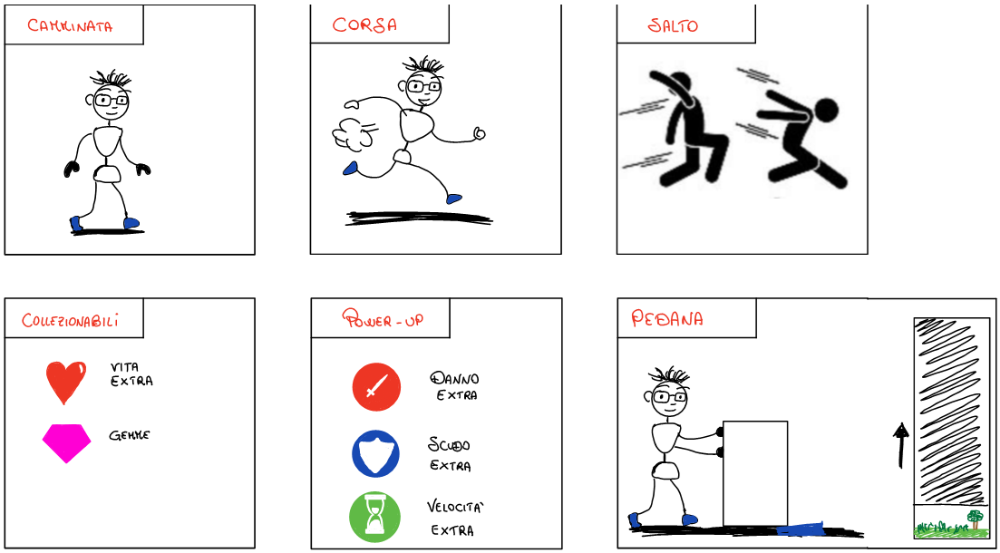

# LowPolyVGD

\-     **Obbiettivi del giuoco**

L’obbiettivo principale del gioco consiste nel superare i diversi livelli presenti superando le varie sfide che verranno poste al giocatore (sconfiggere i nemici e raccogliere il numero di gemme richieste) arrivando così alla battaglia con il boss finale e al salvataggio della principessa.

\-     **Principali dettagli tecnici**

Il gioco consisterà in un Platform 3D. Avrà a disposizione esclusivamente la modalità giocatore singolo. Le armi utilizzate saranno armi medievali o comunque NON da fuoco quindi non verrà implementato nessuna simulazione di proiettili. Per quanto riguarda la presenza di nemici, collezionabili e altro prenderemo come riferimento le linee guida presenti nelle istruzioni fornite a lezione.

\-     **Assets**

Per l’utilizzo di assets, ci baseremo sull’asset store di Unity ed eventualmente ad altri siti in modo. Se necessario provvederemo a modificare qualche aspetto in base alle nostre necessità.

\-     **Scene e livelli**

Il gioco sarà caratterizzato da un’unica scena (open world) con tre diverse ambientazioni, ognuna delle quali corrisponderà a un livello differente. Per poter passare da un livello all’altro sarà necessario uccidere tutti i nemici e talvolta recuperare determinate gemme. Il passaggio da un livello all’altro avverrà tramite portoni o archi o ponti.  Nell’ultima ambientazione nonché ultimo livello sarà presente anche il super boss finale che sarà molto più difficile da sconfiggere. I livelli non potranno essere superati se non si raggiungono gli obbiettivi. L’idea alla base è quella di utilizzare pedane a pressione o teletrasporto, entrambi sbloccabili solo quando gli obiettivi del livello descritti sopra sono stati raggiunti. In ogni livello ci saranno mostri con caratteristiche diverse, nell’ultimo livello invece sarà il boss a generare mostri di supporto ad intervalli regolari, rendendo la sfida più avvincente.  

\-     **Gameplay**

Una volta avviato il gioco, il giocatore potrà scegliere quale livello giocare e sarà presente anche un breve tutorial in cui gli verranno mostrati, attraverso delle finestre di dialogo, tutti i comandi con la possibilità di effettuare una prova.

Il gioco potrà essere salvato in ogni momento mediante il menù di gioco, per consentire al giocatore di riprendere dal punto in cui è arrivato in qualsiasi momento.

In ognuno dei livelli saranno disponibili i seguenti **collezionabili**:

1.  Un cuore nascosto (o dropabile dai nemici) che conferirà una vita aggiuntiva al personaggio principale (in presenza di slot liberi) altrimenti verranno attribuiti punti extra;

2.  Una o più armi sparse per le varie ambientazioni, come ad esempio spade, asce, ecc…. In ogni caso come specificato ci limiteremo ad armi fisiche. Le armi potranno essere scambiate con l’arma attuale. Ogni arma avrà un suo danno associato;

3. Gemme che oltre a far aumentare il punteggio, in alcuni casi saranno strettamente necessarie per progredire all’interno del gioco.

Nel passaggio tra i livelli sarà inserito un piccolo enigma facilmente risolvibile (es. spostare un blocco di pietra sopra una determinata zona per aprire la porta (pedana a pressione), rompere un lucchetto, trovare una chiave, ecc…).

I nemici potranno essere sconfitti tramite l’arma del giocatore, allo stesso modo i nemici infliggeranno danni al giocatore tramite le armi o le abilità in loro possesso. Andando avanti con le ambientazioni, la difficoltà aumenterà in maniera progressiva.

All’interno del gioco ci saranno a disposizione 3 differenti **power-up** per far fronte alle difficoltà:

1. 40 secondi di danni extra, abilità che si sbloccherà dopo aver raccolto il relativo segnalino, idealmente a forma di spada;

2.  40 secondi di armatura, che forniranno al giocatore una sorta di aura protettiva che lo proteggerà dai danni per tutta la durata (protezione totale) che si sbloccherà dopo aver raccolto il relativo segnalino, idealmente a forma di scudo;

3. 40 secondi di velocità extra, che permetteranno di muoversi più rapidamente in modo da far fronte a più nemici contemporaneamente o se necessario a cercare un riparo in modo da elaborare una strategia differente in base alla situazione in cui ci si trova. Il segnalino questa volta ricorda una clessidra.

   

------

### File Sources

Low-Poly Environment Assets

LowPoly Environment Pack
https://assetstore.unity.com/packages/3d/environments/landscapes/lowpoly-environment-pack-99479

Standard Assets Unity
https://assetstore.unity.com/packages/essentials/asset-packs/standard-assets-for-unity-2017-3-32351

Low Poly Warrior (Player)
https://sketchfab.com/3d-models/simple-low-poly-warrior-dfa80ceee90c4ec49d3d785c22304ee8

PolyBrush (From package manager)
https://unity3d.com/unity/features/worldbuilding/polybrush

Low-Poly Environment Assets
https://sketchfab.com/3d-models/low-poly-environment-assets-2d7f5f53dfe24f419cc0ac4dc4dd17a1

Low Poly Coin
https://sketchfab.com/3d-models/lowpoly-gold-coin-34794c00e9d140f6b86e930fef18b009

Low Poly Mummy
https://assetstore.unity.com/packages/3d/characters/free-mummy-monster-134212

Polygonal Foliage Asset Package
https://sketchfab.com/3d-models/polygonal-foliage-asset-package-e3c1a1a51788440c9c26c155e6b40f8f

Simple Gems Ultimate Animated Customizable Pack
https://assetstore.unity.com/packages/3d/props/simple-gems-ultimate-animated-customizable-pack-73764

Save Game Assets
https://assetstore.unity.com/packages/tools/input-management/save-game-110382#reviews

Game Music
https://krystal-may.itch.io/into-the-sand-krystal-may

FREE Skybox Extended Shader
https://assetstore.unity.com/packages/vfx/shaders/free-skybox-extended-shader-107400

------

### TODO
- [X] Implement Damaging system
- [x] Enemy random walk?
- [x] Sandy jump sound
- [x] Mummies Sand footsteps sound (Sound Locations???)
- [x] Volume Slider (in main menu and pause menu)
- [x] Audio in game ( music(Tomb Raider??) + wind effect )
- [X] ESC pause game
- [X] Resolt first esc press problem
- [x] Loop storm sound in-game

- [ ] Collectables
- [ ] Load - Save (Binary Formatter!! - NO( *Player prefs have no transform data* ))
- [ ] GUI (coins)
- [ ] Main menu camera wonders around to much. Clamp it straight
- [ ] Transition Animaiton during Scene Loading (Maybe prompt for action in there)
- [ ] Prompt to get Sword GUI (Screen Space, not to get blurred) and level 1 start
- [ ] Levels 2-3
